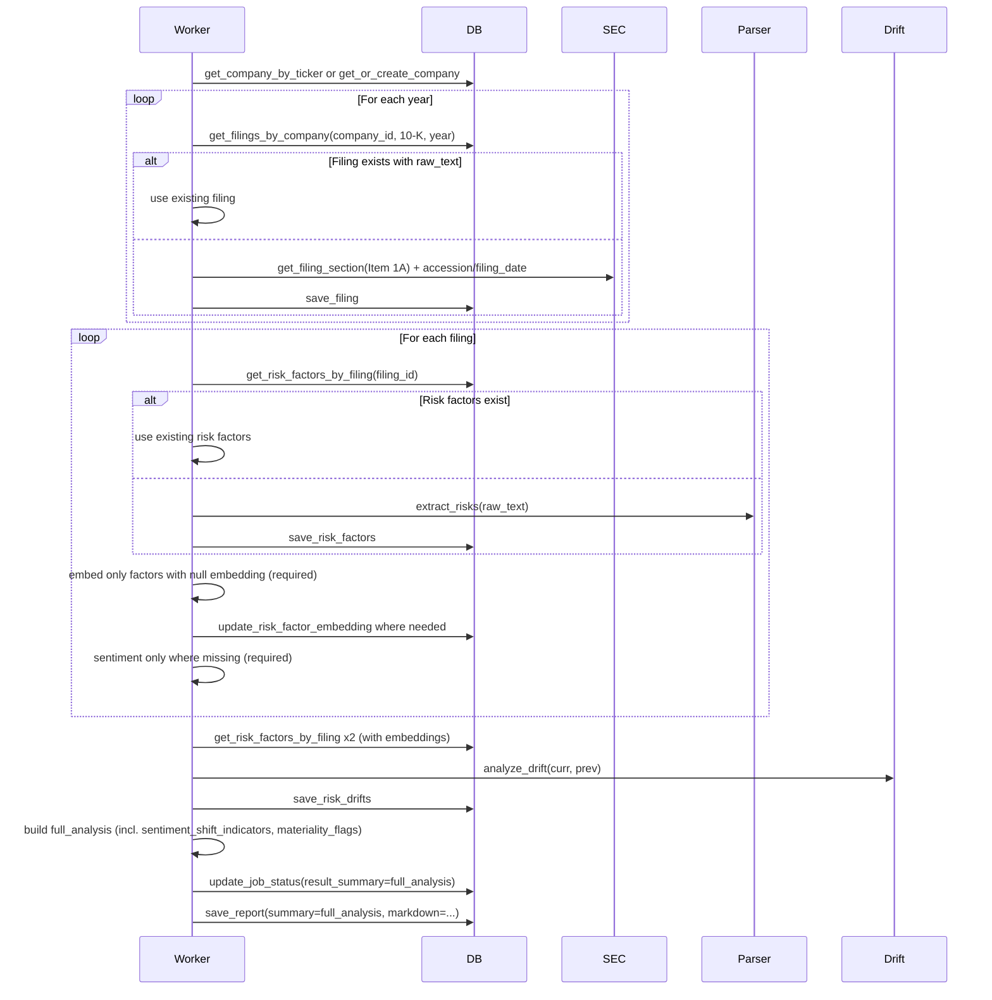

# Populate Database for Risk Drift (full_analysis.json)

## Goal

Risk drift analysis results must match [docs/specs/full_analysis.json](docs/specs/full_analysis.json) and be **persisted** so that:

- **companies**, **filings**, **risk_factors**, **risk_drifts** are populated from the pipeline
- **job_queue.result_summary** (and optionally **reports**) hold the full_analysis payload (meta, visual_priority_map, sentiment_shift_indicators, materiality_flags, removed_risks, heatmap)

Existing schema already supports this: [supabase/migrations/001_initial_schema.sql](supabase/migrations/001_initial_schema.sql) has the right columns; [python/insights/adapters/db/manager.py](python/insights/adapters/db/manager.py) exposes `get_or_create_company`, `save_filing`, `save_risk_factors`, `save_risk_drifts`, `update_job_status(result_summary=...)`, `save_report(..., summary=...)`. The gap is **no pipeline** that fetches data, extracts risks, runs drift, and writes to these tables.

---

## 1. Tables and Current Usage

| Table | Purpose | Already used? | Populated by |

| ---------------- | ---------------------------------------------------------- | ----------------------------------------------------------------------------------------------- | --------------------------------------------------------------------------------------------------------------------------------------------------------------------------------------------------------------------------------------------------------------------------------------------------------------------------------------------------------------------------------------------------- |

| **companies** | Ticker, CIK, name, sector | Yes (get_or_create_company, get_company_by_ticker) | Pipeline: get company info (SECToolkit or MCP), then get_or_create_company |

| **filings** | Per-year 10-K metadata and raw text | save_filing exists; not called in analysis | Pipeline: **Use DB first.** For each year, get_filings_by_company(company_id, form_type="10-K", years=[year]). If filing exists with raw_text, use it; **do not fetch from SEC**. Else: fetch accession + Item 1A via SECToolkit, save_filing. |

| **risk_factors** | Extracted risk titles/content per filing | save_risk_factors, get_risk_factors_by_filing exist; not called | Pipeline: If risk_factors for filing exist in DB, load them (skip extract/embed). Else: RiskFactorParser.extract_risks(raw_text), save_risk_factors; **required** EmbeddingService.embed_batch + update_risk_factor_embedding. Sentiment (e.g. analysis_chunks or per-risk) **required** — compute if missing. |

| **risk_drifts** | Per-drift row (current risk vs prev, zone, heat, snippets) | save_risk_drifts exists; not called | Pipeline: load risk_factors for current + previous filing from DB; run DriftCalculator (with heat/zone/snippets); map each DriftResult to RiskDriftCreate(company_id, risk_factor_id, prev_factor_id, ...) and save_risk_drifts. **Removed** risks: schema has risk_factor_id NOT NULL — store removed_risks only in full_analysis JSON (result_summary / reports.summary), not as risk_drifts rows |

| **job_queue** | result_summary JSONB | update_job_status(..., result_summary=...) used; currently stores `{"content": report.summary}` | Pipeline: set result_summary = full_analysis (meta, visual_priority_map, sentiment_shift_indicators, materiality_flags, removed_risks, heatmap) |

| **reports** | Markdown + summary JSONB | save_report exists; worker has TODO, not called | Pipeline: save_report(company_id, title, report_type="risk_drift", markdown_content=ReportGenerator output, job_id, parameters={ticker, years}, summary=full_analysis) |

---

## 2. Use Existing DB First (Save Tokens, Reduce LLM Cost)

Apply **DB-first** logic everywhere so we avoid re-fetching and re-computing:

- **Company**: get_company_by_ticker(ticker); if found, use company_id; else get company info (SECToolkit), get_or_create_company.
- **Filings**: For each year, get_filings_by_company(company_id, form_type="10-K", years=[year]). If a filing exists and has raw_text (or sufficient content for Item 1A), **do not fetch from SEC**; use that filing. Else: fetch accession + filing_date + Item 1A via SECToolkit, save_filing.
- **Risk factors**: For each filing, get_risk_factors_by_filing(filing_id). If risk factors exist and count is reasonable, **do not re-extract**; use them. Else: extract_risks(raw_text), save_risk_factors.
- **Embeddings**: For each risk factor, if embedding is already present in DB, **do not call EmbeddingService** for that factor. Only embed factors with null embedding (required for drift semantic matching).
- **Sentiment**: For each risk (or chunk), if sentiment already stored (e.g. analysis_chunks or risk-level sentiment), **do not call FinBERT** again. Only run sentiment where missing. Sentiment is **required** for full_analysis (sentiment_shift_indicators, materiality_flags).
- **Modality / strategic rec**: If we cache LLM outputs per (risk_id or content hash), skip re-calling LLM when we have a cached result; otherwise required for full_analysis.

This minimizes SEC/MCP calls, embedding API calls, FinBERT calls, and LLM calls.

---

## 3. Data Flow (High Level)

---

## 4. Assets to Use or Improve

**Use as-is:**

- [DBManager](python/insights/adapters/db/manager.py): get_or_create_company, save_filing, get_filings_by_company, save_risk_factors, get_risk_factors_by_filing, update_risk_factor_embedding, save_risk_drifts, update_job_status, save_report
- [SECToolkit](python/insights/adapters/mcp/toolkit.py): get_filing_section(ticker, "Item 1A" or "risk_factors", "10-K", year), \_get_latest_accession(ticker, form_type, year); get_recent_filings for accession + filing_date
- [RiskFactorParser](python/insights/services/filing/parser.py): extract_risks(filing_text) -> list[ParsedRisk]; map to RiskFactorCreate (title, content, rank)
- [ReportGenerator](python/insights/services/report/generator.py): generate_markdown_report(company, results, expert_findings, summary, ...) — feed results from drift list (with heat_score, zone, etc.)

**Improve:**

- **DriftCalculator** ([python/insights/services/risk/drift_calculator.py](python/insights/services/risk/drift_calculator.py)): (1) Call HeatScorer and ZoneClassifier so each DriftResult has heat_score and zone; (2) Add to DriftResult: modality_shift, analysis, strategic_recommendation, original_text_snippet, new_text_snippet, confidence_score (and optional risk_factor_id / prev_factor_id for DB mapping); (3) Return removed risks separately (list of {risk, rank_prev, status, snippet}) so the pipeline can put them in full_analysis.removed_risks
- **RiskFactor with id**: So the pipeline can map drift results back to DB IDs. Either add optional `id` to [drift_calculator.RiskFactor](python/insights/services/risk/drift_calculator.py) and (risk_factor_id, prev_factor_id) to DriftResult, or pass in-memory id mapping in the pipeline and attach IDs after analyze_drift
- **Pipeline service or worker steps**: A dedicated “risk drift pipeline” function that: gets company; fetches Item 1A + metadata for both years; saves filings; extracts and saves risk factors; loads risk factors (with IDs); runs drift; builds full_analysis; saves risk_drifts (for non-removed); updates job result_summary; saves report

---

## 4. Implementation Steps

1. **Extend DriftCalculator and DriftResult**
   - Add HeatScorer/ZoneClassifier so heat_score and zone are set per drift.
   - Add modality_shift, analysis, strategic_recommendation, original_text_snippet, new_text_snippet, confidence_score to DriftResult.
   - Return a structure that includes drifts + removed_risks (or keep removed in a separate list from the calculator).

2. **Add IDs to drift flow**
   - When loading risk factors from DB, pass id into DriftCalculator (e.g. RiskFactor gains optional id; DriftResult gains risk_factor_id, prev_factor_id).
   - Or: after analyze_drift, match by (title, rank) to current/previous risk factor records to set risk_factor_id and prev_factor_id when building RiskDriftCreate.

3. **Dedicated pipeline (service or in worker) with DB-first and required embeddings/sentiment**
   - Input: ticker, years (e.g. [2024, 2023]).
   - **Company**: get_company_by_ticker; if missing, get_company_info then get_or_create_company.
   - **Filings**: For each year, get_filings_by_company(company_id, form_type="10-K", years=[year]). If filing exists with raw_text, use it (do not fetch from SEC). Else: fetch accession + filing_date + Item 1A, save_filing.
   - **Risk factors**: For each filing, get_risk_factors_by_filing. If present, use them. Else: extract_risks(raw_text), save_risk_factors.
   - **Embeddings (required)**: For each risk factor with null embedding, call EmbeddingService.embed_batch and update_risk_factor_embedding. Skip factors that already have embeddings.
   - **Sentiment (required)**: For each risk (or content chunk) where sentiment is missing, run FinBERT (and modality/strategic rec via LLM if needed). Use existing analysis_chunks or risk-level sentiment when already stored. Populate sentiment_shift_indicators and materiality_flags in full_analysis.
   - Load risk factors for both filings (with embeddings).
   - Run DriftCalculator.analyze_drift(current_risks, previous_risks) with IDs attached.
   - Build full_analysis: meta, visual_priority_map, sentiment_shift_indicators, materiality_flags, removed_risks, heatmap.
   - Map DriftResults (non-removed) to RiskDriftCreate and save_risk_drifts.
   - Return full_analysis and markdown from ReportGenerator.

4. **Wire pipeline into worker**
   - In [python/insights/workers/tasks.py](python/insights/workers/tasks.py), for risk drift jobs: call the new pipeline instead of (or in addition to) the orchestrator; get company_id (get_company_by_ticker after get_or_create_company); then update_job_status(job_id, COMPLETED, result_summary=full_analysis); save_report(company_id, title, "risk_drift", markdown_content, job_id, parameters={ticker, years}, summary=full_analysis).

5. **API / job result**
   - Ensure job result (e.g. GET /jobs/:id or SSE) returns result_summary so clients receive the full_analysis structure. [api/routes/stream.py](python/insights/api/routes/stream.py) already exposes job.result_summary; confirm analysis route returns it as well.

---

## 6. Required: Embeddings and Sentiment

- **Embeddings (required)**: Every risk factor used in drift must have an embedding for semantic matching. After save_risk_factors (or when loading from DB), for any factor with null embedding call EmbeddingService.embed_batch and update_risk_factor_embedding. Do **not** re-embed factors that already have embeddings (saves tokens/cost).
- **Sentiment (required)**: full_analysis.sentiment_shift_indicators and materiality_flags require sentiment (and modality shift and strategic recommendation). Use FinBERT (and LLM for modality/strategic rec) for each risk or chunk; **use existing stored sentiment when present** (e.g. from analysis_chunks or prior run) to avoid duplicate FinBERT/LLM calls.

---

## 7. Files to Touch

- [python/insights/services/risk/drift_calculator.py](python/insights/services/risk/drift_calculator.py) — DriftResult fields; call HeatScorer/ZoneClassifier; return removed_risks.
- [python/insights/experts/toolkits/risk.py](python/insights/experts/toolkits/risk.py) — If toolkit continues to call DriftCalculator, ensure it passes through new fields; pipeline may call DriftCalculator directly.
- New module or steps in worker: e.g. `python/insights/services/risk_drift/pipeline.py` or logic inside `_analyze_risk_drift_async` that does fetch → filings → risk factors → drift → full_analysis → DB writes.
- [python/insights/workers/tasks.py](python/insights/workers/tasks.py) — Invoke pipeline; persist result_summary and save_report.
- [python/insights/adapters/db/manager.py](python/insights/adapters/db/manager.py) — RiskDriftCreate already has all needed fields; no schema change required unless we add a table for “removed” (optional).

This keeps the existing schema and DBManager and focuses on a single pipeline that populates all tables and the full_analysis payload.
