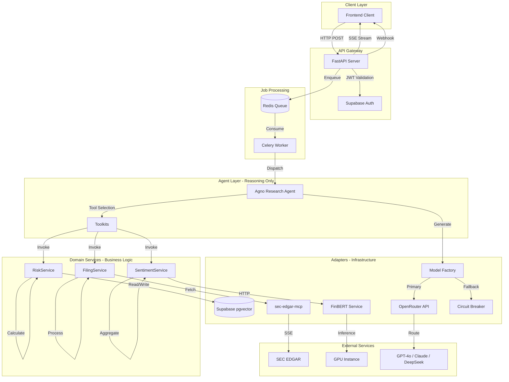

# 01. Architecture & Repository Structure

## Overview

InSights-ai follows a **Layered Architecture** with strict separation between Agent Orchestration (reasoning) and Domain Services (business logic). This document defines the system boundaries, component interactions, and structural requirements.

---

## System Architecture



---

## Layer Responsibilities

### 1. API Layer (`insights/server/`)

**Purpose:** HTTP interface, authentication, request routing.

| Component | Responsibility |
|-----------|----------------|
| `api/research.py` | POST `/analyze` → enqueue job, GET `/stream/{job_id}` → SSE |
| `api/data.py` | GET `/filings`, POST `/search` → vector search |
| `middleware/auth.py` | Validate Supabase JWT Bearer tokens |
| `middleware/errors.py` | Catch exceptions, format SSE error events |

**Key Constraint:** No business logic. Only routing and serialization.

---

### 2. Worker Layer (`insights/workers/`)

**Purpose:** Background job execution via Celery.

```python
# insights/workers/analysis_worker.py
from celery import Celery
from insights.agents.research import get_research_agent

app = Celery('insights', broker='redis://localhost:6379/0')

@app.task(bind=True, max_retries=3)
def analyze_filing(self, job_id: str, request: dict):
    """
    Long-running analysis task.
    Updates job status in Supabase.
    Sends webhook on completion.
    """
    try:
        agent = get_research_agent()
        result = agent.run(request)
        # Update job_queue table: status='completed'
        # Trigger webhook callback
    except Exception as e:
        # Update job_queue table: status='failed', error=str(e)
        self.retry(exc=e, countdown=60)
```

---

### 3. Agent Layer (`insights/agents/`)

**Purpose:** Reasoning and tool orchestration. The agent **decides** what to do, not **how**.

**Allowed Operations:**
- Select which toolkit/tool to call
- Compose multi-step workflows
- Generate final synthesis via LLM

**Forbidden Operations:**
- Direct computation (math, parsing)
- Direct API calls to external services
- Database queries

```python
# insights/agents/research/agent.py
from agno.agent import Agent
from agno.models.openai import OpenAIChat
from .toolkits import get_research_toolkits

def get_research_agent() -> Agent:
    return Agent(
        model=OpenAIChat(id="gpt-4o"),  # Via ModelFactory in production
        description="Deep Research Analyst for SEC Filings",
        instructions=[
            "1. Use SECToolkit to fetch filing content.",
            "2. Use FilingToolkit to chunk and embed text.",
            "3. Use SentimentToolkit to analyze with FinBERT.",
            "4. Use RiskToolkit to calculate drift and heatmap.",
            "5. Synthesize findings into a Markdown report."
        ],
        tools=get_research_toolkits(),
        markdown=True,
        structured_outputs=True  # Pydantic response models
    )
```

---

### 4. Domain Services Layer (`insights/services/`)

**Purpose:** All business logic and computation. Pure Python, no agent awareness.

| Service | Module | Key Functions |
|---------|--------|---------------|
| **RiskService** | `services/risk/` | `calculate_drift()`, `compute_heat_score()`, `classify_zone()` |
| **FilingService** | `services/filing/` | `chunk_text()`, `generate_embeddings()`, `parse_sections()` |
| **SentimentService** | `services/sentiment/` | `analyze_batch()`, `aggregate_scores()` |
| **ReportService** | `services/report/` | `format_markdown()`, `render_template()` |

**Example: RiskService**

```python
# insights/services/risk/drift_calculator.py
import numpy as np
from numpy.linalg import norm
from rapidfuzz import fuzz
from dataclasses import dataclass
from typing import List, Optional

@dataclass
class RiskFactor:
    title: str
    content: str
    rank: int
    embedding: Optional[List[float]] = None

@dataclass
class DriftResult:
    risk_title: str
    rank_current: int
    rank_prev: Optional[int]
    rank_delta: Optional[int]
    semantic_score: float
    drift_type: str  # "structural", "semantic", "new", "removed", "stable"
    heat_score: int
    zone: str  # "critical_red", "warning_orange", "new_blue", "stable_gray"

class DriftCalculator:
    """Pure business logic - no LLM, no I/O."""
    
    FUZZY_THRESHOLD = 85  # Levenshtein similarity threshold
    
    def cosine_similarity(self, v1: List[float], v2: List[float]) -> float:
        """Compute cosine similarity between two vectors."""
        if not v1 or not v2:
            return 0.0
        return float(np.dot(v1, v2) / (norm(v1) * norm(v2)))
    
    def fuzzy_match_title(self, title1: str, title2: str) -> int:
        """Return similarity score 0-100 using Levenshtein distance."""
        return fuzz.ratio(title1.lower(), title2.lower())
    
    def compute_heat_score(self, rank_delta: int, sentiment_impact: float = 0.0) -> int:
        """
        Heat Score Formula:
        (Rank Climb * 2) + (Sentiment Impact * 50), capped at 100
        
        - rank_delta: Positive = climbed up (e.g., 10 → 5 = +5)
        - sentiment_impact: 0.0 to 1.0 (from FinBERT)
        """
        climb_factor = max(0, rank_delta) * 2
        sentiment_factor = int(sentiment_impact * 50)
        return min(100, climb_factor + sentiment_factor)
    
    def classify_zone(self, drift_type: str, rank_delta: Optional[int]) -> str:
        """
        Zone Classification:
        - critical_red: Climbed >5 positions
        - warning_orange: Climbed 1-5 positions
        - new_blue: New risk factor
        - stable_gray: No significant change
        """
        if drift_type == "new":
            return "new_blue"
        if rank_delta is None:
            return "stable_gray"
        if rank_delta > 5:
            return "critical_red"
        if rank_delta >= 1:
            return "warning_orange"
        return "stable_gray"
    
    def analyze_drift(
        self, 
        risks_curr: List[RiskFactor], 
        risks_prev: List[RiskFactor]
    ) -> List[DriftResult]:
        """
        Compare two risk factor lists using fuzzy title matching.
        Returns drift analysis for each current risk.
        """
        results = []
        used_prev_indices = set()
        
        for r_curr in risks_curr:
            best_match = None
            best_score = 0
            best_idx = -1
            
            for i, r_prev in enumerate(risks_prev):
                if i in used_prev_indices:
                    continue
                score = self.fuzzy_match_title(r_curr.title, r_prev.title)
                if score > best_score:
                    best_score = score
                    best_match = r_prev
                    best_idx = i
            
            if best_score > self.FUZZY_THRESHOLD and best_match:
                used_prev_indices.add(best_idx)
                rank_delta = best_match.rank - r_curr.rank
                drift_type = "structural" if abs(rank_delta) >= 3 else "stable"
                
                # Semantic score via cosine similarity
                semantic_score = self.cosine_similarity(
                    r_curr.embedding or [], 
                    best_match.embedding or []
                )
                
                heat_score = self.compute_heat_score(rank_delta)
                zone = self.classify_zone(drift_type, rank_delta)
                
                results.append(DriftResult(
                    risk_title=r_curr.title,
                    rank_current=r_curr.rank,
                    rank_prev=best_match.rank,
                    rank_delta=rank_delta,
                    semantic_score=semantic_score,
                    drift_type=drift_type,
                    heat_score=heat_score,
                    zone=zone
                ))
            else:
                # New risk
                results.append(DriftResult(
                    risk_title=r_curr.title,
                    rank_current=r_curr.rank,
                    rank_prev=None,
                    rank_delta=None,
                    semantic_score=0.0,
                    drift_type="new",
                    heat_score=80,  # New risks are inherently "hot"
                    zone="new_blue"
                ))
        
        return results
```

---

### 5. Adapters Layer (`insights/adapters/`)

**Purpose:** Infrastructure integration. Abstracts external dependencies.

| Adapter | Module | Purpose |
|---------|--------|---------|
| **MCPClient** | `adapters/mcp/client.py` | Persistent SSE connection to sec-edgar-mcp |
| **DBManager** | `adapters/db/manager.py` | Supabase CRUD operations |
| **ModelFactory** | `adapters/models/factory.py` | LLM provider resolution |
| **CircuitBreaker** | `adapters/models/circuit_breaker.py` | Failover logic |

---

## Configuration Files

### `configs/providers/openrouter.yaml`

```yaml
providers:
  openrouter:
    api_base: "https://openrouter.ai/api/v1"
    env_key: "OPENROUTER_API_KEY"
    default_model: "openai/gpt-4o"
    
    models:
      gpt-4o:
        id: "openai/gpt-4o"
        context_window: 128000
        supports_structured_output: true
      
      claude-3.5-sonnet:
        id: "anthropic/claude-3.5-sonnet"
        context_window: 200000
        supports_structured_output: true
      
      deepseek-chat:
        id: "deepseek/deepseek-chat"
        context_window: 64000
        cost_per_1k_input: 0.00014
        cost_per_1k_output: 0.00028
```

### `configs/providers/fallback_chain.yaml`

```yaml
fallback:
  primary: "openai/gpt-4o"
  secondary: "anthropic/claude-3.5-sonnet"
  tertiary: "deepseek/deepseek-chat"
  
  circuit_breaker:
    failure_threshold: 3           # Failures before tripping
    recovery_timeout_seconds: 300  # 5 minutes cooldown
    half_open_requests: 1          # Test requests before closing
```

---

## Error Boundaries

```
┌─────────────────────────────────────────────────────────────────┐
│  API Layer                                                      │
│  • Catches all exceptions                                       │
│  • Returns structured SSE error events or HTTP error responses  │
└─────────────────────────────────────────────────────────────────┘
                              │
                              ▼
┌─────────────────────────────────────────────────────────────────┐
│  Worker Layer                                                   │
│  • Catches task failures                                        │
│  • Updates job_queue with error details                         │
│  • Retries with exponential backoff                             │
└─────────────────────────────────────────────────────────────────┘
                              │
                              ▼
┌─────────────────────────────────────────────────────────────────┐
│  Service Layer                                                  │
│  • Raises domain-specific exceptions                            │
│  • No retry logic (caller's responsibility)                     │
└─────────────────────────────────────────────────────────────────┘
                              │
                              ▼
┌─────────────────────────────────────────────────────────────────┐
│  Adapter Layer                                                  │
│  • @retry decorators (Tenacity) for transient failures         │
│  • Circuit breaker for provider-level failures                  │
│  • Raises specific exceptions (MCPConnectionError, etc.)        │
└─────────────────────────────────────────────────────────────────┘
```

---

## Data Flow Example: Analyze AAPL Risk Drift

```
1. POST /api/v1/research/analyze {"ticker": "AAPL", "years": [2024, 2023]}
   └── API validates JWT, enqueues job, returns job_id

2. Celery Worker picks up job
   └── Creates ResearchAgent instance

3. Agent Reasoning: "I need to fetch AAPL 10-K filings"
   └── Calls SECToolkit.get_filing(ticker="AAPL", year=2024)
   └── Calls SECToolkit.get_filing(ticker="AAPL", year=2023)

4. SECToolkit delegates to MCPClient
   └── MCPClient.call_tool("get_filing_content", {...})
   └── Returns raw text

5. Agent Reasoning: "I need to extract risk factors"
   └── Calls FilingToolkit.parse_risks(text=...)

6. FilingToolkit delegates to FilingService.parse_sections()
   └── Pure Python text processing
   └── Returns List[RiskFactor]

7. Agent Reasoning: "I need sentiment scores"
   └── Calls SentimentToolkit.analyze(risks=...)

8. SentimentToolkit delegates to SentimentService.analyze_batch()
   └── HTTP POST to FinBERT service
   └── Returns scores

9. Agent Reasoning: "I need drift analysis"
   └── Calls RiskToolkit.calculate_drift(curr=..., prev=...)

10. RiskToolkit delegates to DriftCalculator.analyze_drift()
    └── Cosine similarity, fuzzy matching, heat scores
    └── Returns List[DriftResult]

11. Agent Synthesis: "Generate report"
    └── LLM generates Markdown summary
    └── Returns to worker

12. Worker updates job_queue: status='completed'
    └── Triggers webhook callback to frontend
```