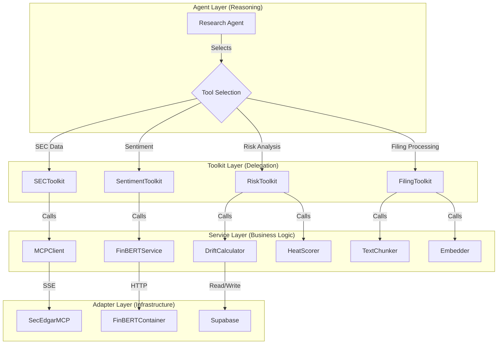

# 06. Agent Orchestration (Agno Implementation)

## Overview

The Agent Orchestration layer implements the **Thin Agent Pattern**: agents handle reasoning and tool selection only, delegating all computation to Domain Services. This separation ensures:

1. **Testability**: Business logic can be unit tested without LLM calls
2. **Maintainability**: Changes to analysis algorithms don't affect agent code
3. **Cost Efficiency**: LLM tokens spent on reasoning, not data processing

---

## Architecture



---

## Research Agent Definition

### `insights/agents/research/agent.py`

```python
"""
Research Agent - Main orchestrator for SEC filing analysis.

This agent reasons about what to do but delegates all execution to toolkits.
It should NEVER contain business logic or direct API calls.
"""
import logging
from typing import Optional
from agno.agent import Agent
from agno.models.openai import OpenAIChat

from insights.core.config import settings
from insights.adapters.models.factory import get_chat_model
from .toolkits import get_all_toolkits
from .prompts import get_system_prompt

logger = logging.getLogger(__name__)


def get_research_agent(
    job_id: Optional[str] = None,
    model_override: Optional[str] = None
) -> Agent:
    """
    Create a configured Research Agent instance.
    
    Args:
        job_id: Optional job ID for tracking and logging
        model_override: Override the default model
        
    Returns:
        Configured Agno Agent
    """
    # Get the LLM model via factory (handles circuit breaker, fallback)
    model_id = model_override or settings.DEFAULT_MODEL
    model = get_chat_model(model_id)
    
    # Get all registered toolkits
    toolkits = get_all_toolkits()
    
    # Build agent
    agent = Agent(
        name="research_agent",
        model=model,
        description="Deep Research Analyst specializing in SEC filing analysis, risk assessment, and financial sentiment.",
        instructions=get_research_instructions(),
        tools=toolkits,
        markdown=True,
        structured_outputs=True,  # Use Pydantic response models
        show_tool_calls=settings.DEBUG,
        # Enable reasoning traces for debugging
        debug_mode=settings.DEBUG
    )
    
    # Attach job context for logging
    if job_id:
        agent.context = {"job_id": job_id}
    
    return agent


def get_research_instructions() -> list:
    """
    Get the agent's core instructions.
    
    These instructions tell the agent WHAT to decide, not HOW to compute.
    """
    return [
        # Data Retrieval
        "1. ALWAYS start by checking what filings are available using SECToolkit.search_filings().",
        "2. Use SECToolkit.get_filing_section() for specific sections like Risk Factors (1A) or MD&A (7).",
        "3. Never process raw filing text directly - always use FilingToolkit to chunk and parse.",
        
        # Analysis Workflow
        "4. For risk drift analysis, you MUST:",
        "   a. Fetch Risk Factors sections for BOTH years using SECToolkit.",
        "   b. Use FilingToolkit.extract_risk_factors() to get structured risk data.",
        "   c. Use SentimentToolkit.analyze_sentiment() on each risk factor.",
        "   d. Use RiskToolkit.calculate_drift() to compare years.",
        "   e. Use RiskToolkit.generate_heatmap() for visualization data.",
        
        # Output Requirements
        "5. Your final response MUST include:",
        "   - An executive summary (2-3 sentences)",
        "   - Key findings with specific risk titles",
        "   - The heatmap data from RiskToolkit",
        "   - Strategic recommendations based on drift patterns",
        
        # Constraints
        "6. NEVER perform calculations yourself - always delegate to tools.",
        "7. NEVER make up data - if a tool fails, report the error.",
        "8. Cite specific risk factor titles and rank changes in your analysis."
    ]
```

---

## Toolkit Registration

### `insights/agents/research/toolkits.py`

```python
"""
Toolkit registration for the Research Agent.

Each toolkit is a thin wrapper that delegates to domain services.
"""
from typing import List, Optional
from agno.tools import Toolkit

from insights.adapters.mcp.toolkit import SECToolkit
from insights.services.sentiment.toolkit import SentimentToolkit
from insights.services.risk.toolkit import RiskToolkit
from insights.services.filing.toolkit import FilingToolkit


def get_all_toolkits() -> List[Toolkit]:
    """
    Get all toolkits for the research agent.
    
    Returns:
        List of initialized toolkit instances
    """
    return [
        SECToolkit(),
        SentimentToolkit(),
        RiskToolkit(),
        FilingToolkit(),
    ]


# ============================================================
# Risk Toolkit - Delegates to Domain Services
# ============================================================

class RiskToolkit(Toolkit):
    """
    Risk analysis toolkit.
    
    Provides tools for risk factor extraction, drift calculation,
    and heatmap generation. All heavy lifting is done by DriftCalculator.
    """
    
    def __init__(self):
        super().__init__(name="risk_toolkit")
        
        # Import services
        from insights.services.risk.drift_calculator import DriftCalculator
        from insights.services.risk.heat_scorer import HeatScorer
        from insights.services.risk.zone_classifier import ZoneClassifier
        
        self.drift_calculator = DriftCalculator()
        self.heat_scorer = HeatScorer()
        self.zone_classifier = ZoneClassifier()
        
        # Register tools
        self.register(self.calculate_drift)
        self.register(self.generate_heatmap)
        self.register(self.get_zone_summary)
    
    async def calculate_drift(
        self,
        current_risks: str,  # JSON string of risk factors
        previous_risks: str  # JSON string of risk factors
    ) -> str:
        """
        Calculate risk drift between two filing years.
        
        Compares risk factors using fuzzy title matching and semantic similarity.
        Returns structured drift analysis with rank changes and classifications.
        
        Args:
            current_risks: JSON string of current year's risk factors
            previous_risks: JSON string of previous year's risk factors
            
        Returns:
            JSON string with drift analysis results
        """
        import json
        from insights.services.risk.drift_calculator import RiskFactor
        
        # Parse inputs
        curr_data = json.loads(current_risks)
        prev_data = json.loads(previous_risks)
        
        curr_factors = [RiskFactor(**r) for r in curr_data]
        prev_factors = [RiskFactor(**r) for r in prev_data]
        
        # Calculate drift using service
        results = self.drift_calculator.analyze_drift(curr_factors, prev_factors)
        
        # Add heat scores
        for r in results:
            r.heat_score = self.heat_scorer.compute(
                rank_delta=r.rank_delta,
                semantic_score=r.semantic_score,
                is_new=(r.drift_type == "new")
            )
            r.zone = self.zone_classifier.classify(r.drift_type, r.rank_delta)
        
        return json.dumps([r.__dict__ for r in results], default=str)
    
    async def generate_heatmap(
        self,
        drift_results: str,  # JSON string from calculate_drift
        ticker: str,
        years: List[int]
    ) -> str:
        """
        Generate heatmap visualization data from drift analysis.
        
        Organizes risks into zones (critical_red, warning_orange, new_blue, stable_gray)
        for frontend visualization.
        
        Args:
            drift_results: JSON string from calculate_drift
            ticker: Company ticker
            years: Comparison years [current, previous]
            
        Returns:
            JSON string with heatmap structure
        """
        import json
        from datetime import datetime, UTC
        
        drifts = json.loads(drift_results)
        
        # Organize by zone
        zones = {
            "critical_red": [],
            "warning_orange": [],
            "new_blue": [],
            "stable_gray": []
        }
        
        for d in drifts:
            zone = d.get("zone", "stable_gray")
            entry = {
                "risk_id": self._make_risk_id(d["risk_title"]),
                "title": d["risk_title"],
                "current_rank": d["rank_current"],
                "rank_delta": d["rank_delta"] if d["drift_type"] != "new" else "NEW",
                "heat_score": d["heat_score"],
                "summary": d.get("analysis", "")
            }
            zones.get(zone, zones["stable_gray"]).append(entry)
        
        heatmap = {
            "heatmap_title": f"{ticker} Risk Profile Evolution ({years[0]} vs {years[1]})",
            "generated_at": datetime.now(UTC).isoformat(),
            "ticker": ticker,
            "zones": zones,
            "statistics": {
                "total_risks": len(drifts),
                "critical_count": len(zones["critical_red"]),
                "warning_count": len(zones["warning_orange"]),
                "new_count": len(zones["new_blue"]),
                "stable_count": len(zones["stable_gray"])
            }
        }
        
        return json.dumps(heatmap)
    
    async def get_zone_summary(self, drift_results: str) -> str:
        """
        Get a text summary of each zone for the agent's synthesis.
        
        Args:
            drift_results: JSON string from calculate_drift
            
        Returns:
            Human-readable summary of zone contents
        """
        import json
        
        drifts = json.loads(drift_results)
        
        zones = {"critical_red": [], "warning_orange": [], "new_blue": [], "stable_gray": []}
        for d in drifts:
            zones.get(d.get("zone", "stable_gray"), zones["stable_gray"]).append(d)
        
        summary_parts = []
        
        if zones["critical_red"]:
            summary_parts.append(
                f"🔴 CRITICAL ({len(zones['critical_red'])}): " +
                ", ".join(d["risk_title"][:50] for d in zones["critical_red"][:3])
            )
        
        if zones["warning_orange"]:
            summary_parts.append(
                f"🟠 WARNING ({len(zones['warning_orange'])}): " +
                ", ".join(d["risk_title"][:50] for d in zones["warning_orange"][:3])
            )
        
        if zones["new_blue"]:
            summary_parts.append(
                f"🔵 NEW ({len(zones['new_blue'])}): " +
                ", ".join(d["risk_title"][:50] for d in zones["new_blue"][:3])
            )
        
        summary_parts.append(f"⚪ STABLE: {len(zones['stable_gray'])} risks unchanged")
        
        return "\n".join(summary_parts)
    
    def _make_risk_id(self, title: str) -> str:
        """Create a normalized ID from risk title."""
        import re
        return re.sub(r'[^a-zA-Z0-9_]', '', title.lower().replace(" ", "_"))[:50]


# ============================================================
# Filing Toolkit - Delegates to Domain Services
# ============================================================

class FilingToolkit(Toolkit):
    """
    Filing processing toolkit.
    
    Provides tools for text chunking, risk extraction, and embedding generation.
    """
    
    def __init__(self):
        super().__init__(name="filing_toolkit")
        
        from insights.services.filing.text_chunker import TextChunker
        from insights.services.filing.parser import RiskFactorParser
        from insights.services.filing.embedder import Embedder
        
        self.chunker = TextChunker()
        self.parser = RiskFactorParser()
        self.embedder = Embedder()
        
        self.register(self.extract_risk_factors)
        self.register(self.chunk_for_sentiment)
        self.register(self.generate_embeddings)
    
    async def extract_risk_factors(
        self,
        filing_text: str,
        filing_date: Optional[str] = None
    ) -> str:
        """
        Extract structured risk factors from 10-K filing text.
        
        Parses the Risk Factors section (Item 1A) and returns a list of
        individual risk factors with titles, content, and ranks.
        
        Args:
            filing_text: Raw text of the filing (preferably just Risk Factors section)
            filing_date: Optional filing date for metadata
            
        Returns:
            JSON string with list of risk factors
        """
        import json
        
        risks = await self.parser.extract_risks(filing_text, filing_date)
        return json.dumps([r.to_dict() for r in risks])
    
    async def chunk_for_sentiment(
        self,
        text: str,
        chunk_size: int = 450
    ) -> str:
        """
        Split text into chunks suitable for FinBERT analysis.
        
        Respects sentence boundaries and stays within BERT's context window.
        
        Args:
            text: Text to split
            chunk_size: Target chunk size in tokens
            
        Returns:
            JSON list of text chunks
        """
        import json
        
        chunks = self.chunker.chunk_text(text, window_size=chunk_size)
        return json.dumps(chunks)
    
    async def generate_embeddings(
        self,
        texts: str  # JSON list of texts
    ) -> str:
        """
        Generate vector embeddings for texts.
        
        Uses Google text-embedding-004 model for semantic search.
        
        Args:
            texts: JSON list of texts to embed
            
        Returns:
            JSON list with texts and their embeddings
        """
        import json
        
        text_list = json.loads(texts)
        results = await self.embedder.embed_batch(text_list)
        return json.dumps(results)
```

---

## Agent Execution Flow

### Example: Risk Drift Analysis

```python
# insights/workers/analysis_worker.py

from celery import Celery
from insights.agents.research import get_research_agent
from insights.adapters.db.manager import DBManager

app = Celery('insights')


@app.task(bind=True, max_retries=3)
async def analyze_risk_drift(self, job_id: str, request: dict):
    """
    Execute risk drift analysis workflow.
    
    The agent orchestrates the workflow; services do the work.
    """
    db = DBManager()
    
    try:
        # Update job status
        await db.update_job_status(job_id, "processing", progress=0)
        
        # Create agent
        agent = get_research_agent(job_id=job_id)
        
        # Construct the analysis request
        ticker = request["ticker"]
        years = request.get("years", [2024, 2023])
        
        prompt = f"""
        Analyze risk drift for {ticker} comparing fiscal years {years[0]} and {years[1]}.
        
        Steps:
        1. Fetch the Risk Factors section (Item 1A) from both 10-K filings
        2. Extract individual risk factors from each filing
        3. Analyze sentiment for each risk factor
        4. Calculate drift between the two years
        5. Generate heatmap visualization data
        6. Provide executive summary and recommendations
        
        Include specific risk titles, rank changes, and sentiment scores in your analysis.
        """
        
        # Run the agent
        response = await agent.arun(prompt)
        
        # Extract structured results from response
        # The agent's tools return JSON that we can parse
        result_data = extract_structured_results(response)
        
        # Save to database
        await save_analysis_results(db, job_id, ticker, result_data)
        
        # Update job status
        await db.update_job_status(
            job_id, 
            "completed", 
            progress=100,
            result_summary=result_data.get("summary")
        )
        
        # Trigger webhook if configured
        await send_webhook_if_configured(job_id)
        
    except Exception as e:
        logger.error(f"Analysis failed for job {job_id}: {e}")
        await db.update_job_status(
            job_id, 
            "failed", 
            error_message=str(e)
        )
        self.retry(exc=e, countdown=60)
```

---

## Workflow Diagram

```
┌─────────────────────────────────────────────────────────────────────────────┐
│  Risk Drift Analysis Workflow                                               │
└─────────────────────────────────────────────────────────────────────────────┘

User Request: "Analyze AAPL risk drift 2024 vs 2023"
    │
    ▼
┌─────────────────────────────────────────────────────────────────────────────┐
│  Agent Reasoning Step 1                                                      │
│  "I need to fetch AAPL 10-K filings for both years"                         │
│  → Selects: SECToolkit.get_filing_section(ticker="AAPL", section="1A", ...)│
└─────────────────────────────────────────────────────────────────────────────┘
    │
    ▼
┌─────────────────────────────────────────────────────────────────────────────┐
│  Tool Execution (Delegated to Service Layer)                                │
│  SECToolkit → MCPClient → sec-edgar-mcp → Returns Risk Factors text        │
└─────────────────────────────────────────────────────────────────────────────┘
    │
    ▼
┌─────────────────────────────────────────────────────────────────────────────┐
│  Agent Reasoning Step 2                                                      │
│  "I have the raw text, now I need to extract structured risk factors"      │
│  → Selects: FilingToolkit.extract_risk_factors(filing_text=...)            │
└─────────────────────────────────────────────────────────────────────────────┘
    │
    ▼
┌─────────────────────────────────────────────────────────────────────────────┐
│  Tool Execution (Delegated to Service Layer)                                │
│  FilingToolkit → RiskFactorParser → Returns List[RiskFactor] as JSON       │
└─────────────────────────────────────────────────────────────────────────────┘
    │
    ▼
┌─────────────────────────────────────────────────────────────────────────────┐
│  Agent Reasoning Step 3                                                      │
│  "Now I need sentiment scores for each risk factor"                         │
│  → Selects: SentimentToolkit.analyze_sentiment(texts=...)                   │
└─────────────────────────────────────────────────────────────────────────────┘
    │
    ▼
┌─────────────────────────────────────────────────────────────────────────────┐
│  Tool Execution (Delegated to Service Layer)                                │
│  SentimentToolkit → FinBERTClient → Returns List[SentimentResult]          │
└─────────────────────────────────────────────────────────────────────────────┘
    │
    ▼
┌─────────────────────────────────────────────────────────────────────────────┐
│  Agent Reasoning Step 4                                                      │
│  "I have both years' data, now calculate the drift"                         │
│  → Selects: RiskToolkit.calculate_drift(current_risks=..., prev_risks=...) │
└─────────────────────────────────────────────────────────────────────────────┘
    │
    ▼
┌─────────────────────────────────────────────────────────────────────────────┐
│  Tool Execution (Delegated to Service Layer)                                │
│  RiskToolkit → DriftCalculator.analyze_drift() → Returns List[DriftResult]│
│  (Cosine similarity, fuzzy matching, heat scores - all pure Python)        │
└─────────────────────────────────────────────────────────────────────────────┘
    │
    ▼
┌─────────────────────────────────────────────────────────────────────────────┐
│  Agent Reasoning Step 5                                                      │
│  "Generate the heatmap for visualization"                                   │
│  → Selects: RiskToolkit.generate_heatmap(drift_results=...)                │
└─────────────────────────────────────────────────────────────────────────────┘
    │
    ▼
┌─────────────────────────────────────────────────────────────────────────────┐
│  Agent Synthesis                                                             │
│  LLM generates executive summary, recommendations, and formatted report    │
│  Combines all tool outputs into coherent analysis                           │
└─────────────────────────────────────────────────────────────────────────────┘
    │
    ▼
Final Response (Markdown Report + Heatmap JSON)
```

---

## Agent Configuration

### `configs/agents/research_agent.yaml`

```yaml
research_agent:
  model: "openai/gpt-4o"
  fallback_model: "anthropic/claude-3.5-sonnet"
  
  temperature: 0.1  # Low for analytical tasks
  max_tokens: 4096
  
  timeout_seconds: 300  # 5 minutes max per task
  
  toolkits:
    - sec_toolkit
    - sentiment_toolkit
    - risk_toolkit
    - filing_toolkit
  
  structured_output: true
  
  # Prompt template location
  system_prompt: "prompts/research_agent_system.jinja2"
  
  # Debug settings
  show_tool_calls: ${DEBUG:-false}
  log_reasoning: ${DEBUG:-false}
```

---

## Testing the Agent

### `tests/integration/test_research_agent.py`

```python
"""Integration tests for the Research Agent."""
import pytest
from unittest.mock import AsyncMock, patch

from insights.agents.research import get_research_agent


@pytest.fixture
def mock_mcp_client():
    """Mock SEC MCP client."""
    mock = AsyncMock()
    mock.call_tool.return_value = """
    ITEM 1A. RISK FACTORS
    
    Our business faces significant risks...
    
    **Supply Chain Concentration**
    We rely heavily on suppliers in Asia...
    
    **Regulatory Uncertainty**
    Changes in government policies...
    """
    return mock


@pytest.fixture
def mock_finbert():
    """Mock FinBERT service."""
    mock = AsyncMock()
    mock.predict.return_value = [
        {"label": "negative", "score": 0.85, "scores": {"negative": 0.85}}
    ]
    return mock


@pytest.mark.asyncio
async def test_agent_risk_drift_workflow(mock_mcp_client, mock_finbert):
    """Test the complete risk drift analysis workflow."""
    with patch("insights.adapters.mcp.toolkit.get_mcp_client", return_value=mock_mcp_client):
        with patch("insights.services.sentiment.finbert_analyzer.get_finbert_analyzer", return_value=mock_finbert):
            agent = get_research_agent(job_id="test-123")
            
            response = await agent.arun(
                "Analyze risk drift for AAPL comparing 2024 and 2023"
            )
            
            assert response.content is not None
            assert "AAPL" in response.content
            # Agent should have called tools
            assert mock_mcp_client.call_tool.called
```