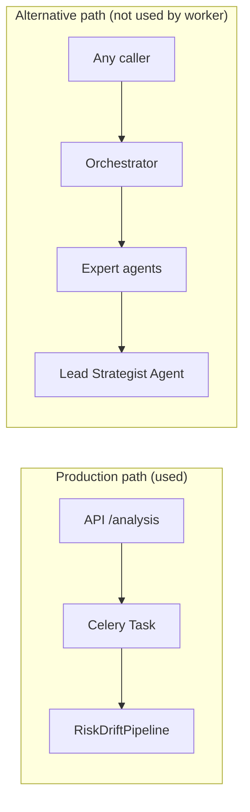
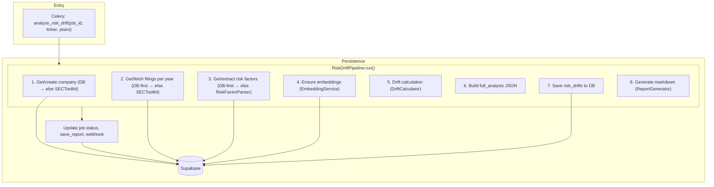
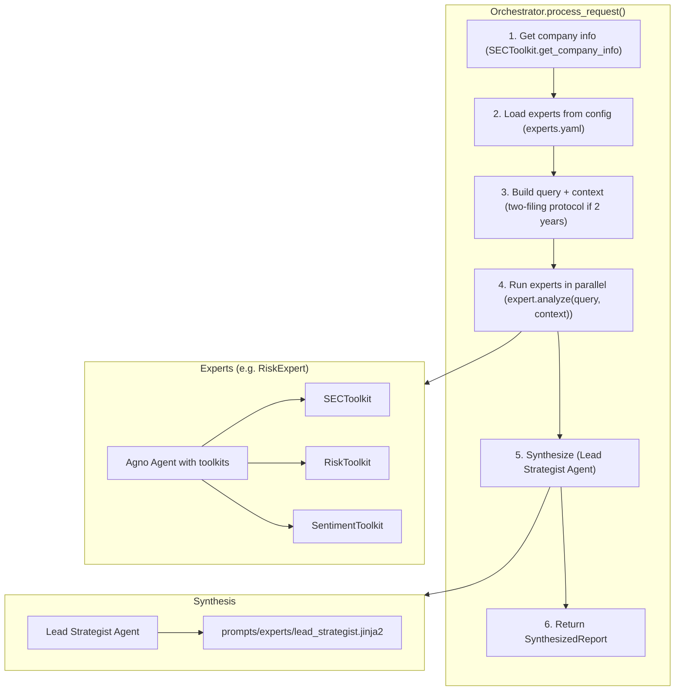
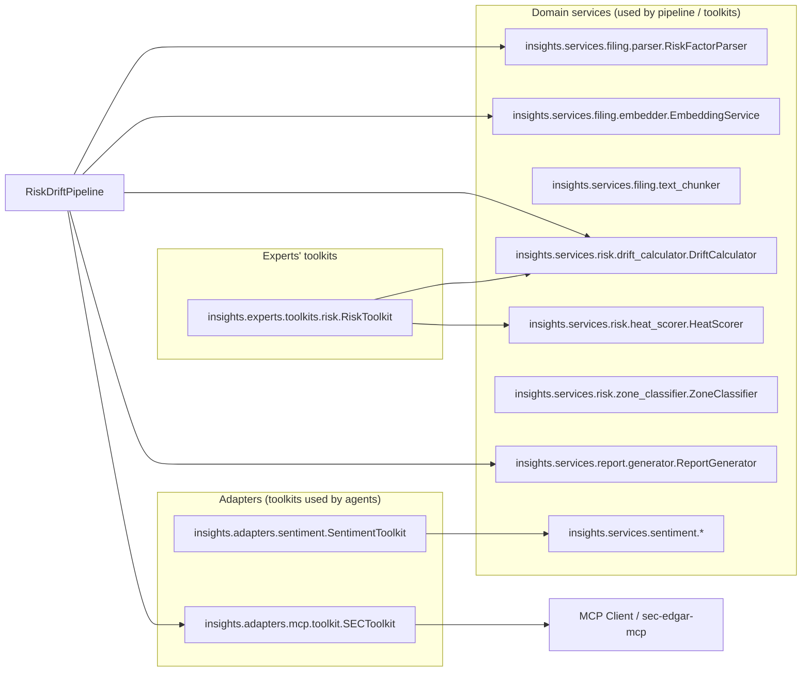
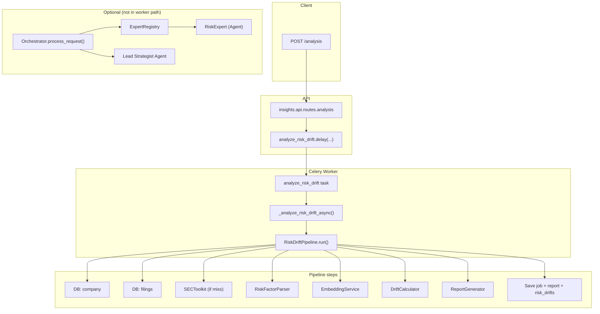

# Actual Agent & Orchestration Implementation

This document describes **how the system is actually implemented**, not the spec in `06_AGENT_ORCHESTRATION.md`. Use it as the source of truth for architecture and flow.

---

## 1. High-Level: Two Paths

We have two distinct flows; only one is used by the API and Celery worker.

| Path | Trigger | What runs | Used by |
|------|---------|-----------|--------|
| **Production** | `POST /analysis` → `analyze_risk_drift.delay(...)` | `RiskDriftPipeline.run(ticker, years)` | API, Celery worker |
| **Alternative** | Direct `Orchestrator().process_request(...)` | Experts in parallel → synthesis | Scripts / future use only; **not** invoked by the worker |

The Celery task **does not** call the Orchestrator; it calls the pipeline directly.

---

## 2. Production Path: Risk Drift Pipeline (Detail)

This is the path that runs when a user submits an analysis job.

### Steps in code

| Step | Method / component | Delegates to |
|------|--------------------|--------------|
| 1 | `_get_or_create_company(ticker)` | `DBManager.get_company_by_ticker` → else `SECToolkit.get_company_info` + `get_or_create_company` |
| 2 | `_get_or_fetch_filing(company_id, ticker, year)` | DB filings by company/year → else SEC Item 1A via `SECToolkit`, then `save_filing` |
| 3 | `_get_or_extract_risk_factors(filing)` | DB risk factors for filing → else `RiskFactorParser` + save |
| 4 | `_ensure_embeddings(risks)` | `EmbeddingService` (only where embedding missing) |
| 5 | Drift | `DriftCalculator.analyze_drift(current_risk_factors, previous_risk_factors)` |
| 6 | `_build_full_analysis(...)` | Inline (zones, meta, summary) |
| 7 | `_save_risk_drifts(company_id, drifts)` | `DBManager` |
| 8 | Report | `ReportGenerator.generate_markdown_report(...)` |

**Key point:** No LLM or agent runs inside this pipeline. All logic is deterministic services + DB.

---

## 3. Alternative Path: Orchestrator + Experts

Used only when something explicitly calls `Orchestrator().process_request(ticker, years)` (e.g. a script). The Celery worker does **not** use this.

### Orchestrator in code

- **Module:** `insights/agents/orchestrator/agent.py`
- **Config:** `configs/experts.yaml` (list of experts and their classes)
- **Synthesis prompt:** `configs/prompts/experts/lead_strategist.jinja2`
- **Output:** `SynthesizedReport` (company, summary, expert_findings, risk_level, recommendations)

### Experts

- **Registry:** `insights/experts/registry.py` — `load_from_yaml(experts.yaml)`, `list_experts()`
- **Base:** `insights/experts/base.py` — `BaseExpert` wraps an Agno `Agent` with name, description, instructions, tools
- **Example:** `insights/experts/risk.py` — **RiskExpert** with:
  - **Toolkits:** `SECToolkit`, `RiskToolkit`, `SentimentToolkit` (no FilingToolkit)
  - **Prompt:** `configs/prompts/experts/risk_analyst.jinja2`
  - **Flow:** `analyze(query, context)` → build enhanced query → `run_agent(enhanced_query)` → wrap response in `ExpertResult`

---

## 4. Toolkit & Service Layout (Actual)

### Notes

- **No `insights/agents/research/`** — no Research Agent and no `get_all_toolkits()`.
- **No FilingToolkit** — filing logic lives only in services (`RiskFactorParser`, `EmbeddingService`, `TextChunker`). No agent-facing FilingToolkit.
- **RiskToolkit** lives under **experts**: `insights/experts/toolkits/risk.py`. It exposes `analyze_risk_drift` and `calculate_heat_score` (not the spec’s `calculate_drift` / `generate_heatmap` / `get_zone_summary`).
- **SentimentToolkit** is in **adapters** (`insights/adapters/sentiment.py`), not `insights.services.sentiment.toolkit`.

---

## 5. Where Things Live (Quick Reference)

| Concept | Spec (06_AGENT_ORCHESTRATION) | Actual implementation |
|--------|--------------------------------|-------------------------|
| Main agent | Research Agent @ `agents/research/agent.py` | None. Production uses **RiskDriftPipeline** (no agent). Optional path: **Orchestrator** + Experts. |
| Toolkits for “research” | `agents/research/toolkits.py` + get_all_toolkits() | No research module. **RiskExpert** uses SECToolkit, RiskToolkit, SentimentToolkit from adapters/experts. |
| FilingToolkit | In spec, with extract_risk_factors, chunk_for_sentiment, generate_embeddings | **Does not exist.** Filing = services only (parser, embedder, chunker). |
| Worker | `workers/analysis_worker.py` → get_research_agent(), agent.arun() | `workers/tasks.py` → **RiskDriftPipeline.run()** (Orchestrator imported but not used in task). |
| Config | `configs/agents/research_agent.yaml` | **configs/experts.yaml** + **configs/prompts/experts/*.jinja2**. No research_agent.yaml. |

---

## 6. Data Flow Summary

1. **API** `POST /analysis` creates a job and enqueues `analyze_risk_drift.delay(job_id, ticker, years, ...)`.
2. **Celery** runs `_analyze_risk_drift_async`, which:
   - Updates job status to running
   - Instantiates **RiskDriftPipeline(db)** and calls **pipeline.run(ticker, years)**
   - On success: updates job completed, saves report to DB, publishes progress, optional webhook
   - On failure: updates job failed, optional webhook
3. **RiskDriftPipeline** does all work: company → filings → risk factors → embeddings → drift → full_analysis → save risk_drifts → markdown report. No agent calls.
4. **Orchestrator** is never invoked by this flow; it is a separate entry point for an expert-based, LLM-driven analysis if called explicitly.

---

## 7. Diagram: Full System Context

---

## 8. Key Files Reference

### Orchestration

| Role | File | Purpose |
|------|------|--------|
| Orchestrator agent | `python/insights/agents/orchestrator/agent.py` | `Orchestrator` class: company info, dispatch to experts, synthesis via Lead Strategist |
| Orchestrator package | `python/insights/agents/orchestrator/__init__.py` | Exports `Orchestrator` |
| Synthesis prompt | `configs/prompts/experts/lead_strategist.jinja2` | System prompt for the Lead Strategist Agent |
| Orchestrator prompt (if used) | `configs/prompts/orchestrator.jinja2` | Optional orchestrator-level prompt |

### Experts

| Role | File | Purpose |
|------|------|--------|
| Expert registry | `python/insights/experts/registry.py` | `ExpertRegistry`: load from YAML, `register()`, `list_experts()` |
| Expert base | `python/insights/experts/base.py` | `BaseExpert`: wraps Agno Agent with name, description, instructions, tools |
| Risk expert | `python/insights/experts/risk.py` | `RiskExpert`: SECToolkit + RiskToolkit + SentimentToolkit, prompt from risk_analyst.jinja2 |
| Experts config | `configs/experts.yaml` | Which experts exist, class paths, tools, routing, enabled flag |
| Risk expert prompt | `configs/prompts/experts/risk_analyst.jinja2` | System instructions for Risk Expert agent |

### Tools (toolkits)

| Toolkit | File | Tools / methods |
|---------|------|------------------|
| SEC | `python/insights/adapters/mcp/toolkit.py` | `SECToolkit`: `get_filing`, `get_filing_section`, `get_company_info`; `SearchToolkit` |
| Sentiment | `python/insights/adapters/sentiment.py` | `SentimentToolkit`: `analyze_sentiment`, `get_sentiment_scores` |
| Risk | `python/insights/experts/toolkits/risk.py` | `RiskToolkit`: `analyze_risk_drift`, `calculate_heat_score` |

### Supporting (used by orchestration / experts / pipeline)

| Role | File | Purpose |
|------|------|--------|
| MCP client | `python/insights/adapters/mcp/client.py` | `get_mcp_client()`, used by SECToolkit |
| Pipeline (production path) | `python/insights/services/risk_drift/pipeline.py` | `RiskDriftPipeline.run()` — used by Celery, not Orchestrator |
| Celery task | `python/insights/workers/tasks.py` | `analyze_risk_drift` → `RiskDriftPipeline` |
| Domain services | `python/insights/services/risk/*.py`, `filing/*.py`, `report/*.py` | DriftCalculator, HeatScorer, RiskFactorParser, EmbeddingService, ReportGenerator |

---

*Last updated to reflect codebase as of the verification against `06_AGENT_ORCHESTRATION.md`.*
